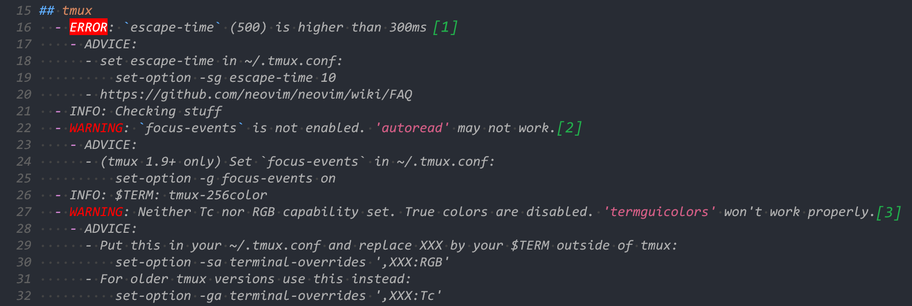
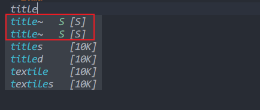
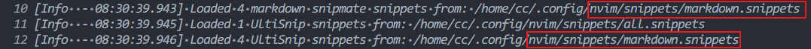

<!-- markdownlint-disable MD013 -->
# my neovim config

## reference

> [LunarVim/Neovim-from-scratch](https://github.com/LunarVim/Neovim-from-scratch)  
> [NvChad/NvChad>](https://github.com/NvChad/NvChad>)  
> [yaocccc/nvim](https://github.com/yaocccc/nvim)

## 配置问题记录

#### 特定文件类型加载插件

在加载插件时添加 `ft = { "lua", "json"... }` 配置。

如果文件没有类型，如 `*.snippets` 文件，可以通过 `vim.filetype.add` 进行自定义:

```lua
vim.filetype.add({
    pattern = {
        ['.*%.snippets'] = 'snippets',  -- 定义 *.snippets 文件类型为 snippets
    },
})
```

### nvim 与主机剪贴板互通

> [https://www.cnblogs.com/huahuayu/p/12235242.html](https://www.cnblogs.com/huahuayu/p/12235242.html)

1. 安装 xclip

    ```sh
    sudo pacman -S xclip
    ```

2. 修改 nvim 配置

    ```lua
    -- ',' 后面不能有空格

    -- lua style
    vim.opt.clipboard:prepend { "unnamed,unnamedplus" }

    -- vimscript style
    set clipboard^=unnamed,unnamedplus
    ```

#### windows wsl 下 nvim 与主机剪贴板互通 (**已弃用: 修改为使用 [Tmux Clipboar](#tmux-clipboard)**)

- 方案一: [how-to-use-the-windows-clipboard-from-wsl](https://github.com/neovim/neovim/wiki/FAQ#how-to-use-the-windows-clipboard-from-wsl)

    ```sh
    curl -sLo/tmp/win32yank.zip https://github.com/equalsraf/win32yank/releases/download/v0.0.4/win32yank-x64.zip
    unzip -p /tmp/win32yank.zip win32yank.exe > /tmp/win32yank.exe
    chmod +x /tmp/win32yank.exe
    sudo mv /tmp/win32yank.exe /usr/local/bin/
    ```

    然后执行上面第2步的修改，如果安装了 `xclip` 需要先卸载，可以执行 `checkhealth` 查看 `Clipboard (optional)` 状态

    解决配置 `clipboard` 后启动速度慢的问题: [neovim/issues/9570](https://github.com/neovim/neovim/issues/9570). 添加配置:

    ```lua
    vim.cmd([[
    let g:clipboard = {
        \ 'name': 'win32yank',
        \ 'copy': {
        \    '+': 'win32yank.exe -i --crlf',
        \    '*': 'win32yank.exe -i --crlf',
        \  },
        \ 'paste': {
        \    '+': 'win32yank.exe -o --lf',
        \    '*': 'win32yank.exe -o --lf',
        \ },
        \ 'cache_enabled': 0,
        \ }
    ]])
    ```

- 方案二: 查看nvim帮助文档 `:help clipboard-wsl`. 不需要额外安装软件，只需要添加配置:

    ```lua
    vim.cmd([[
    let g:clipboard = {
        \   'name': 'WslClipboard',
        \   'copy': {
        \      '+': 'clip.exe',
        \      '*': 'clip.exe',
        \    },
        \   'paste': {
        \      '+': 'powershell.exe -c [Console]::Out.Write($(Get-Clipboard -Raw).tostring().replace("`r", ""))',
        \      '*': 'powershell.exe -c [Console]::Out.Write($(Get-Clipboard -Raw).tostring().replace("`r", ""))',
        \   },
        \   'cache_enabled': 0,
        \ }
    ]])
    ```

#### Tmux Clipboard

由于 `win32yank` 和 `WslClipboard` 只能在 Windows 环境下使用, 其他环境下该配置都会报错, 所以替换成了更通用的 `Tmux Clipboard`

```lua
if vim.env.TMUX then
vim.g.clipboard = {
    name = "TmuxClipboard",
    copy = {
        ["+"] = "tmux load-buffer -w -",
        ["*"] = "tmux load-buffer -w -",
    },
    paste = {
        ["+"] = "tmux save-buffer -",
        ["*"] = "tmux save-buffer -",
    },
}
end
```

注: 如果按照 `:help clipboard` 帮助文档设置 `g.clipboard.copy` 项:

```lua
copy = {
    ["+"] = "tmux load-buffer -",
    ["*"] = "tmux load-buffer -",
}
```

Nvim剪贴板和系统剪贴板是没有互通的, 暂时不知道原因, 后面按照 [aserowy/tmux.nvim](https://github.com/aserowy/tmux.nvim/blob/main/lua/tmux/copy.lua) 中的 `sync_clipboard` 设置, 剪贴板就成功互通了.

```lua
copy = {
    ["+"] = "tmux load-buffer -w -",
    ["*"] = "tmux load-buffer -w -",
},
```

`checkhealth` 的错误与警告修复方法:



1. echo "set -g escape-time 10" >> ~/.tmux.conf
2. echo "set -g focus-events on" >> ~/.tmux.conf
3. echo "set -g terminal-overrides ',$TERM:RGB'" >> ~/.tmux.conf    **`需要退出Tmux再执行`**

### coc.nvim 配置

- 无特殊说明所有配置项均添加在 `nvim/coc-settings.json` 文件中，可以使用 `:CocConfig` 来进行配置

1. coc.nvim

    - 补全配置默认不选中第一个补全提示参数: `"suggest.noselect": true`
    - ~~指定文件类型保存时自动格式化/不格式化: `"[json]": { "coc.preferences.formatonsave": true }`~~
    - 关闭文件保存自动格式化: `"coc.preferences.formatOnSave": false`
    - 开启指定文件类型保存自动格式化: `"[go]": { "coc.preferences.formatOnSave": true }`
    - 自动显示当前行的所有诊断信息: `"diagnostic.checkCurrentLine": true`
    - 诊断信息显示优先等级: `"diagnostic.signPriority": 1`

2. coc-sumneko-lua

    - 构造表不显示数组索引: `"Lua.hint.arrayIndex": "Disable"`
    - 关闭内联提示: `"Lua.hint.enable": false`
    - 中文补全提示: `"sumneko-lua.locale": "zh-cn"`

3. coc-snippets

    - 使用 `vscode` 的 `.json` 代码块配置: `"snippets.textmateSnippetsRoots": ["~/.config/nvim/snippets"]` [coc-snippets/issues/280](https://github.com/neoclide/coc-snippets/issues/280)
    - 添加了 `endsnippet` 后代码补全提示会出现两个相同 `snippet` 的问题:

        

        通过 `:CocCommand snippets.openOutput` 查看日志可以发现同一个 `.snippets` 文件被 `snipmate` 和 `UltiSnip` 分别加载了一次

        

        所以通过 `CocConfig` 禁用掉其中一个就可以了: `"snippets.snipmate.enable": false`

### todo-comments.nvim

```sh
sudo pacman -S ripgrep
```

### tagbar

```sh
sudo pacman -S ctags
```

## 其他问题

### 使用 `lua` 配置和 `Vimscript` 相同的配置

可以在 `:help lua` 帮助文档下查找

### 去掉 `nvim` 启动时显示的欢迎界面

1. 下载源码: `git clone https://github.com/neovim/neovim`
2. 修改源码:

    ```c
    // neovim/src/nvim/drawscreen.c
    int update_screen(void)
    {
        static bool did_intro = false; // true -> false
    ...
    ```

3. 重新编译安装: `sudo make install CMAKE_BUILD_TYPE=Release -j8`

### treesitter checkhealth WARNING

> WARNING `tree-sitter` executable not found (parser generator, only needed for :TSInstallFromGrammar, not required for :TSInstall)

```sh
sudo pacman -S tree-sitter tree-sitter-cli
```

### C/CPP 的 `Doxygen` 注释支持

1. 帮助文档: `:h doxygen.vim`
2. 在 `c/cpp` 文件中手动执行 `:set syntax=c.doxgen` 可以看到 `Doxygen` 注释的高亮
3. 添加配置 `vim.g.load_doxygen_syntax = 1` 可以自动实现高亮 `Doxygen`
4. `Doxygen` 注释各部分的高亮设置见 `./colors/onedark.lua` 中 `doxygen` 部分
5. **如果开启了 `nvim-treesitter` 插件的高亮支持，`Doxygen` 注释无法显示高亮，暂未解决，只能关闭除 `markdown` 之外的高亮**
6. [danymat/neogen](https://github.com/danymat/neogen) 插件实现自动生成 `Doxygen` 注释

### markdown-preview 配置

- 插件: [iamcco/markdown-preview.nvim](https://github.com/iamcco/markdown-preview.nvim)
- 通过插件管理器安装后需要到插件目录下手动执行 `yarn install` 或 `npm install` 命令
